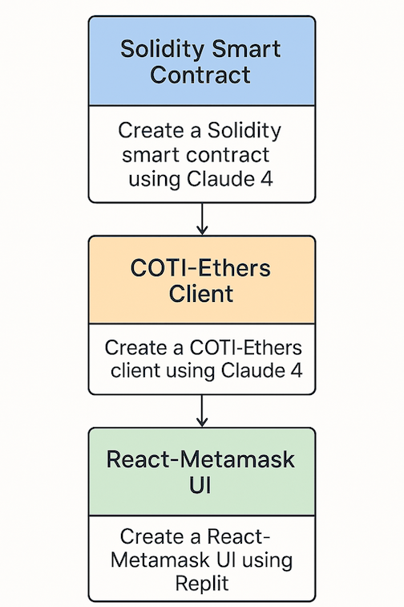

## DATA PRIVACY FRAMEWORK DEMO

DataPrivacyFramework.sol enables building privacy-preserving applications like a  ticketing system, where ticket prices, supplies, and purchase history remain private while still enabling necessary computations and verifications.

### Key Benefits

1. **Privacy**: Values are encrypted end-to-end, never visible on-chain
2. **Computability**: Can perform operations on encrypted data
3. **Access Control**: Built-in permission system controls who can access what
4. **Selective Disclosure**: Results can be encrypted for specific users
5. **Auditability**: Computations are verifiable without revealing inputs



## How to Use DataPrivacyFrameworkMpc

### 1. Contract Setup

```
import "@coti-io/coti-contracts/contracts/access/DataPrivacyFramework/extensions/DataPrivacyFrameworkMpc.sol";

contract YourContract is DataPrivacyFrameworkMpc {
    constructor() DataPrivacyFrameworkMpc(false, false) {
        // false, false = default permissions for addresses and operations
  
        // Set up permissions
        setPermission(InputData(msg.sender, "admin", true, 0, 0, false, false, 0, address(0), ""));
    }
}
```

How `setPermission(InputData(msg.sender, "admin", true, 0, 0, false, false, 0, address(0), ""))` Works

1. **InputData Struct Breakdown**

The `InputData` struct has these fields, and here's what each parameter means:

```solidity
struct InputData {
    address caller;          // msg.sender (contract deployer)
    string operation;        // "admin" 
    bool active;            // true (permission is active)
    uint256 timestampBefore; // 0 (no expiration date)
    uint256 timestampAfter;  // 0 (no start delay)
    bool falseKey;          // false (don't force denial)
    bool trueKey;           // false (don't force approval)
    uint256 uintParameter;   // 0 (no uint parameter constraint)
    address addressParameter; // address(0) (no address parameter constraint)
    string stringParameter;  // "" (no string parameter constraint)
}
```

So the call translates to:

```solidity
InputData(
    msg.sender,    // caller = contract deployer's address
    "admin",       // operation = "admin" 
    true,          // active = permission is enabled
    0,             // timestampBefore = no expiration
    0,             // timestampAfter = no start delay  
    false,         // falseKey = don't force deny
    false,         // trueKey = don't force allow
    0,             // uintParameter = no constraint
    address(0),    // addressParameter = no constraint
    ""             // stringParameter = no constraint
)
```

### 2. **What `setPermission` Does**

The function creates a new permission entry:

```solidity
function setPermission(InputData memory inputData) public returns (bool) {
    if (permissions[inputData.caller][inputData.operation] == 0) {
        // First time setting this permission
        permissions[inputData.caller][inputData.operation] = _conditionsCount;
  
        conditions[_conditionsCount] = Condition(
            _conditionsCount,           // id
            inputData.caller,           // msg.sender
            inputData.operation,        // "admin"
            inputData.active,           // true
            inputData.falseKey,         // false
            inputData.trueKey,          // false
            inputData.timestampBefore,  // 0
            inputData.timestampAfter,   // 0
            inputData.uintParameter,    // 0
            inputData.addressParameter, // address(0)
            inputData.stringParameter   // ""
        );
  
        ++_conditionsCount;
        ++activePermissions[inputData.caller];
    }
    // ... else update existing permission
}
```

### 3. **The Permission System Architecture**

The framework uses a two-level mapping system:

```solidity
mapping(address => mapping(string => uint256)) public permissions; // caller => operation => condition_id
mapping(uint256 => Condition) public conditions; // condition_id => condition details
```

So after the call:

- `permissions[msg.sender]["admin"]` = `1` (condition ID)
- `conditions[1]` = the `Condition` struct with your parameters
- `activePermissions[msg.sender]` = `1` (this address has 1 active permission)

4. **How It Works in Practice**

When someone calls a function protected by:

```solidity
onlyAllowedUserOperation("admin", 0, address(0), "")
```

The modifier checks:

1. Is the `"admin"` operation allowed? ✅ (set in constructor: `allowedOperations["admin"] = true`)
2. Does `msg.sender` have permission for `"admin"`?
   - Look up `permissions[msg.sender]["admin"]` → gets condition ID
   - Look up `conditions[conditionId]` → gets the condition details
   - Check if condition is active and constraints are met

In the constructor, this call:

```solidity
setPermission(InputData(msg.sender, "admin", true, 0, 0, false, false, 0, address(0), ""));
```

**Grants the contract deployer full admin privileges** by:

- ✅ **Active**: `true` - permission is enabled
- ✅ **No time limits**: `timestampBefore: 0, timestampAfter: 0` - always valid
- ✅ **No forced outcomes**: `falseKey: false, trueKey: false` - normal evaluation
- ✅ **No parameter constraints**: all parameters are neutral/empty

This means the deployer can call any function requiring `"admin"` privileges without restrictions.

6. **Alternative Examples**

Here are some other permission configurations:

```solidity
// Time-limited permission (valid until timestamp 1735689600)
setPermission(InputData(user, "admin", true, 1735689600, 0, false, false, 0, address(0), ""));

// Permission that always allows (trueKey = true)
setPermission(InputData(user, "admin", true, 0, 0, false, true, 0, address(0), ""));

// Permission with uint parameter constraint (only for eventId = 123)
setPermission(InputData(user, "purchase_ticket", true, 0, 0, false, false, 123, address(0), ""));

// Disabled permission
setPermission(InputData(user, "admin", false, 0, 0, false, false, 0, address(0), ""));
```

This permission system provides fine-grained access control for your privacy-preserving smart contracts!

### 2. **Storing Encrypted Data**

```
function setItem(string memory name, itUint64 calldata value) 
    external 
    onlyAllowedUserOperation("op_set_item", 0, address(0), "")
{
    // Validate and convert user input to computation-ready format
    gtUint64 gtEncryptedValue = MpcCore.validateCiphertext(value);
  
    // Store as encrypted ciphertext
    encryptedValues[name] = MpcCore.offBoard(gtEncryptedValue);
}
```

### 3. **Retrieving Encrypted Data**

```
function getItem(string memory name) 
    external 
    onlyAllowedUserOperation("op_get_item", 0, address(0), name)
{
    // Convert stored ciphertext to computation format
    gtUint64 gtEncryptedValue = MpcCore.onBoard(encryptedValues[name]);
  
    // Encrypt specifically for the requesting user
    ctUint64 ctEncryptedInput = MpcCore.offBoardToUser(gtEncryptedValue, msg.sender);
  
    // Emit as event (cannot return encrypted values directly)
    emit encryptedUint(msg.sender, ctEncryptedInput);
}
```

### 4. **Computing on Encrypted Data**

```
function getClearOilCotiPrice() 
    external 
    onlyAllowedUserOperation("op_get_clear_oil_usd_price", 0, address(0), "")
    onlyAllowedUserOperation("op_get_clear_coti_usd_price", 0, address(0), "")
{
    // Load encrypted values
    gtUint64 a = MpcCore.onBoard(encryptedValues["oil_usd_price"]);
    gtUint64 b = MpcCore.onBoard(encryptedValues["coti_usd_price"]);
  
    // Perform computation on encrypted data
    gtUint64 c = MpcCore.div(a, b); // Oil/COTI ratio
  
    // Decrypt and emit result
    emit clearUint(msg.sender, MpcCore.decrypt(c));
}
```

### PROMPT FOR SMART CONTRACT

```
@Cluade4 @DataPrivacyFramework.sol @OnChainDatabase.sol

A ticketing system that ensures user privacy. 
Users can purchase and store event tickets digitally, 
with each ticket uniquely tied to its owner to prevent counterfeiting and unauthorized resale. Implementing garbled circuits for privacy allows users to prove ticket ownership without revealing personal information. Smart contracts can automate ticket transfers and enforce resale policies, ensuring fair pricing and reducing fraud.
```

RESULT --> solidity/PrivateTicketingDebug.sol

### 5. **Client-Side Usage** (TypeScript/JavaScript)

```
import { Wallet, itUint } from '@coti-io/coti-ethers';

// Initialize wallet and onboard for encryption
const wallet = new Wallet(privateKey, provider);
await wallet.generateOrRecoverAes();

// Encrypt data for contract input
const encryptedPrice: itUint = await wallet.encryptValue(
    100n, // price value
    contractAddress,
    contract.interface.getFunction("setItem").selector
);

// Call contract with encrypted data
await contract.setItem("oil_price", encryptedPrice);

 
```

### PROMPT FOR CLIENT

```
@Claude4 @coti-ethers @solidity/PrivateTicketingDebug.sol 

create a typescript client that exposes all the functions of the PrivateTicketingDebug.sol  using @coti-ethers library
deployed on COTI.Testnetwork at
COTI Network Configuration
COTI_RPC_URL=https://testnet.coti.io/rpc
COTI_CHAIN_ID=7082400

Example Private Keys (REPLACE WITH YOUR TEST KEYS)
ACCOUNT_ENCRYPTION_KEY='49d9a80420ffe615de763b8cebd64dca'

PRIVATE_KEY=9ba41a77e1408b426b9fe43078aad218ee16f06fafad4896411a07611532fd5c
PRIVATE_KEY_1=9ba41a77e1408b426b9fe43078aad218ee16f06fafad4896411a07611532fd5c
PRIVATE_KEY_2=0xfedcba0987654321fedcba0987654321fedcba0987654321fedcba0987654321

CONTRACT_ADDRESS=0xbdFAb135CAcCF157216d36Bb822aC37419A3387B

```

**RESULT --> typescript-client**

```
cd typescript-client
node dist/demo.jsnode
```

### CREATING UI ON REPLIT

```
@typescript-client/dist/demo.js @typescript-client/dist/PrivateTicketingClient.js @coti-ethers/build/cotiethers.js

Given the client above for the coti smart contract deployed at

COTI Network Configuration
COTI_RPC_URL=https://testnet.coti.io/rpc
COTI_CHAIN_ID=7082400

Example Private Keys (REPLACE WITH YOUR TEST KEYS)
ACCOUNT_ENCRYPTION_KEY='49d9a80420ffe615de763b8cebd64dca'

PRIVATE_KEY=9ba41a77e1408b426b9fe43078aad218ee16f06fafad4896411a07611532fd5c
PRIVATE_KEY_1=9ba41a77e1408b426b9fe43078aad218ee16f06fafad4896411a07611532fd5c
PRIVATE_KEY_2=0xfedcba0987654321fedcba0987654321fedcba0987654321fedcba0987654321

Optional: Deploy contract address (leave empty to deploy new)
CONTRACT_ADDRESS=0xbdFAb135CAcCF157216d36Bb822aC37419A3387B

Optional: Gas settings
GAS_LIMIT=500000
GAS_PRICE=1000000000

Create a React UI for the app using the coti-etherJS client files attached for smart contract comunication


```

RESULT --> https://coti-ticketing-percivallucena.replit.app
