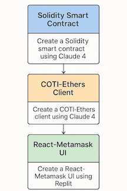

## DATA PRIVACY FRAMEWORK DEMO

DataPrivacyFramework.sol enables building privacy-preserving applications like a  ticketing system, where ticket prices, supplies, and purchase history remain private while still enabling necessary computations and verifications.

### Key Benefits

1. **Privacy**: Values are encrypted end-to-end, never visible on-chain
2. **Computability**: Can perform operations on encrypted data
3. **Access Control**: Built-in permission system controls who can access what
4. **Selective Disclosure**: Results can be encrypted for specific users
5. **Auditability**: Computations are verifiable without revealing inputs



How to Use DataPrivacyFrameworkMpc

### 1. Contract Setup

```
import "@coti-io/coti-contracts/contracts/access/DataPrivacyFramework/extensions/DataPrivacyFrameworkMpc.sol";

contract YourContract is DataPrivacyFrameworkMpc {
    constructor() DataPrivacyFrameworkMpc(false, false) {
        // false, false = default permissions for addresses and operations
  
        // Set up permissions
        setPermission(InputData(msg.sender, "admin", true, 0, 0, false, false, 0, address(0), ""));
    }
}
```


```
PROMPT FOR SMART CONTRACT**`
@Cluade4 @DataPrivacyFramework.sol

A ticketing system that ensures user privacy. 
Users can purchase and store event tickets digitally, 
with each ticket uniquely tied to its owner to prevent counterfeiting and unauthorized resale. Implementing garbled circuits for privacy allows users to prove ticket ownership without revealing personal information. Smart contracts can automate ticket transfers and enforce resale policies, ensuring fair pricing and reducing fraud.
```

TEXT

> ```
> RUN DEMO
>
> cd solidity
> python3 -m venv coti
> source coti/bin/activate
> pip install -r requirements.txt
> python private_ticketing_demo_fixed.py 
>
> ```

PROMPTS
